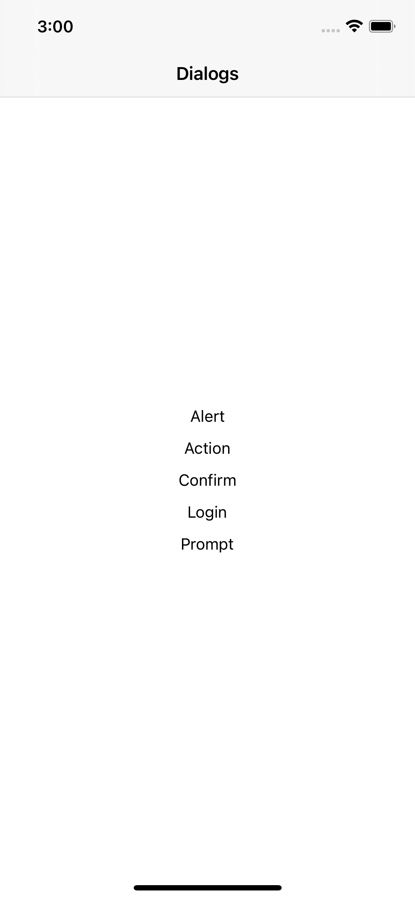

# Dialogs

This demonstrates the different dialog options that come out of the box with NativeScript. These dialogs can be very useful for all sorts of interaction in app. They can be customized and used in different ways.

| Android |        iOS         |
| :-----: | :----------------: |
|   :x:   | :white_check_mark: |

## Resources:

- [Docs](https://docs.nativescript.org/interaction.html#dialogs)
- [Github](https://github.com/NativeScript/NativeScript/tree/master/packages/core/ui/dialogs)

## Usage

Run commands should be entered from root of project, not at app level.

### For iOS:

`nx run nativescript-dialogs:ios`

### To clean project:

`nx run nativescript-dialogs:clean`

### Demo Image:

</img>
