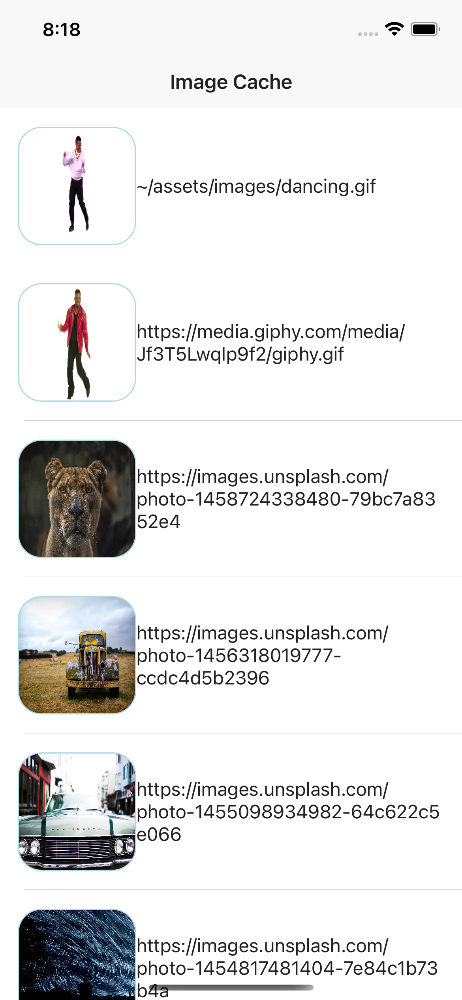

# Image Cache Demo

This demo is using the Image-Cache-It Plugin and was created using the demo-ng app in the plugin repo as a guide. The app will download images and or gifs and load them in device memory to cache. This allows you to leave the app and come back with the images already downloaded. Check out the plugin here: [image-cache-it](https://github.com/triniwiz/nativescript-image-cache-it)

Currently only iOS is supported and that app is locked in light mode for demo purposes.

| Android |        iOS         |
| :-----: | :----------------: |
|   :x:   | :white_check_mark: |

## Resources:

Image Cache It Plugin:

- [API Reference](https://triniwiz.github.io/nativescript-plugins/api-reference/image-cache-it.html)
- [Github](https://github.com/triniwiz/nativescript-image-cache-it)

## Usage

Run commands should be entered from root of project, not at app level.
### For iOS:

`nx run nativescript-image-cache:ios`

### To clean project:

`nx run nativescript-image-cache:clean`

### Demo Image:

</img>
