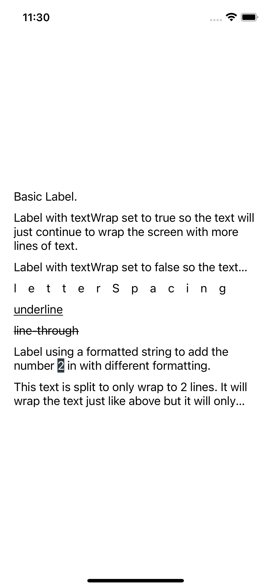
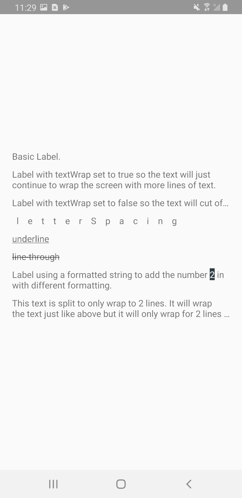

# Labels Demo

This demo shows some of what is capable using the nativescript labels. One of the more exciting things is accessing native apis. The last label in this shows how to access native iOS and Android apis to limit the number of lines the Label will wrap to.

| Android |        iOS         |
| :-----: | :----------------: |
| :white_check_mark: | :white_check_mark: |

## Resources:

- [Label Docs](https://docs.nativescript.org/ui-and-styling.html#label)
- [Label Code](https://github.com/NativeScript/NativeScript/tree/75b59ecdbf9ecd7c63684ca72b97b963356952d4/packages/core/ui/label)

The NativeScript Label component uses the [TextView Widget](https://developer.android.com/reference/android/widget/TextView.html) for Android and the [UILabel](https://developer.apple.com/documentation/uikit/uilabel) for iOS.

## Usage

Run commands should be entered from root of project, not at app level.

### For iOS:

`nx run nativescript-labels:ios`

### For Android:

`nx run nativescript-labels:android`

### To clean project:

`nx run nativescript-labels:clean`

### Demo Images:

| iOS | Android|
| --- | ---|
| | |