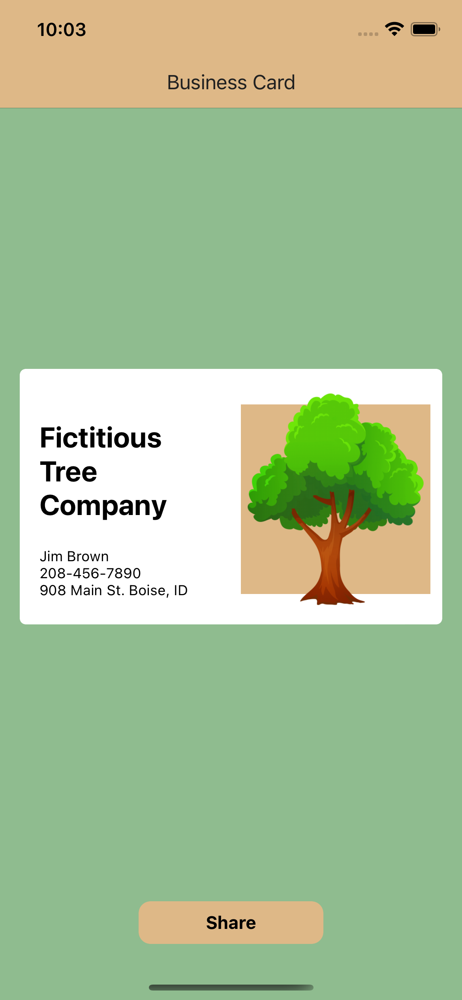

# Screenshot Share Demo

This demo can grab a view, create an image from it and then pass it to the share sheet to be shared outside of the app.

Currently only iOS is supported and that app is locked in light mode for demo purposes.

| Android |        iOS         |
| :-----: | :----------------: |
|   :x:   | :white_check_mark: |

TODO:
* Add icon
* Add launch screen
* Add save button (save to photo library)
* Add dialog popup confirming save
* Add font awesome icons

### For iOS:

`nx run nativescript-screenshot-share:ios`

### To clean project:

`nx run nativescript-screenshot-share:clean`

### Demo Image:

</img>
